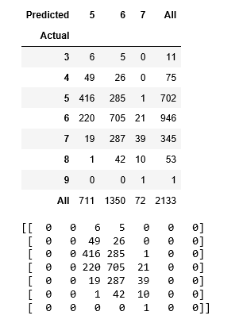

## Introduction
This study aims to compare the performance of different supervised learning algorithms to predict wine quality based on a wine’s physicochemical test results. Wine quality assessment is crucial in the wine industry and is assessed based on physicochemical tests at laboratories and on sensory tests that rely on human experts opinion on wine preferences [1].

## Background and Motivation - Renee
-> Why this is important? Can take from the proposal. 
-> give the ratio of test and training for all models 
-> Add outline of the webapage/presentation.

## Data Description and Initial Data Exploration
This section presents insights on the wine quality dataset which will be used to model quality predictions. 

### Data Distribution in Dataset by Quality Lables and Wine Type

Describe features, labels - Renee

Add visualizations - Renee
 

Present key insights - Renee

### Feature Pairplot

Key insight on correlation betwen features - Renee

## Initial Data Exploration 
### Principal Componenet Analysis - Abhilasha
A dataset with 12 feature pushes us to conduct a Principal Componenet Analysis on the data to consider possibility of dimenstion reduction. Principal componenet analysis result for complete dataset reveals that 0.99 of total variance in dataset is explained by first 11 eigen values. PCA result indicated not much of dimension reduction can be achieved by using 2 or 3 principal componenets. Thus, there are not easily identifiable directions in which signiifcant variance of the data points can be captured. 

[0.3176715, 0.21069888, 0.12999856, 0.08094213, 0.06034393, 0.0510322, 0.04471237, 0.04190673, 0.02934314, 0.02139346, 0.00994418]

<iframe width="700" height="700" frameborder="0" scrolling="no" src="//plot.ly/~abhilashasaroj/108.embed"></iframe>

Describe PC scores and result
Add visualizations

## Supervised Learning Models for Wine Quality Prediction
-> Add outline
### Quality Prediction Using Linear Regression and Polynomical Regression - Yi
First, let's look at the correlation among features and label('quality'):

From the correlation map, we can see that the most correlated feature with 'quality' is 'alchol'.
Then we want to plot the relation between each feature and label:

We can see that the linear relation bewteen each features and label is not very good prediction, so we want to do a linear combination of all features of dataset to do the prediction. 
#### (1) Linear Regression
We first split our training and test data into 66% and 34%, then we did the Linear Regression Model to fit our function, here's the outcome of our "true_y vs. predicted_y" :

##### the calculated MSE = 0.5409578
##### Test Score = 0.299689

#### (2) Polynomial Regression
First, Let's try fit the function when degree n = 3, the "true_y vs. predicted_y" looks like this:

##### the calculated MSE = 0.5327816
##### Test Score = 0.2732067
it is worthnoting that the degree of polynormial function influece the fitting of model, beacaue we don't want to overfit or underfit the model. so we plot the 'MSE vs. polynormial degree n' to see which degree has the lowest MSE value:

##### Discussion 
By comparing the MSE between linear regression model and polynormial model, we can conclude that for our dataset, polynormial model (when n = 2) is a little bit better than linear regression model and n = other values.

### Quality Prediction Using Ridge Regression and Lasso Regression - Yi 
#### (3) Ridge Regression
For Ridge Regression, we add a regulation in the function to reduce the magnitude of the coefficients. Our goal is to find the 
\lambda that can optimize the parameters. If we look at the cofficients for different features in RR here:

As we increase \lambda, we will see that the magnitude of coefficeints decrease.This is because higher the \lambda is, bigger is the penalty and therefore, the magnitude of coefficients are reduced.

if we look at the "MSE vs. \lambda" :

 we can see that MSE will decrease first as \lambda increases and then it ramp to really high value,the lowest MSE was reached when \lambda is 100, we also plotted the "score vs. \lambda":

we see for this case, score is presentinf an opposite trend as MSE, but it also shows a highest score at \lambda = 100.

##### at \lambda = 100, the MSE = 0.3799 and the Test score = 0.34

#### (4) Lasso Regression

For Lasso Regerssion, the regulation method is different with Ridge Regression. in RR, the regulation is related to squared coefficience, however, in LR, the regulation is only related to absolute value of coefficience. Therefore, we are expecting that when we increase the value of \lambda, coefficeints are approaching towards 0!!!! therefore, Lasso selects some features while reduce the coefficients of others to zero. if we look at the the cofficients for different features in LR here:

if we look at the "MSE vs. \lambda" :

 we can see that MSE keeps increase as we increase \lambda, and then it reach a platue states. we also plotted the "score vs. \lambda":

we can see the Lasso regression can get a higher score when \lambda is really small. at \lambda = 0.0001, the MSE = 0.42578, and Test score = 0.39

##### Discussion 

|Model         | Linear        |
| ------------- | ------------- |
| MSE          | 0.5409       |
| TEST Score   | 0.299        |

### Quality Prediction Using Logistic Regression - Abhilasha

#### Discussion 

### Quality Prediction Using Decision Tree and Random Ensemble Classifier - Abhilasha
#### Decision Tree Classifier

Accuracy = 

##### Pruned Decision Tree Classifier
Depth=5

Accuracy =

Depth =3

Accuracy =

##### Discussion 

#### Ensemble Random Forest Classifier

Result for Random Forest Classifier with following attributes

1. n_estimators = 100
2. Depth_limit = None
3. Bootstrap = True, Model uses bootstrapped dataset to create trees instead of while dataset.

*Accuracy score = 0.62*

### Quality Prediction Using Support Vector Machine - Ogulcan

#### Model Cross Validation Results

#### Discussion 

## Comparison of Prediction Models

| First Header  | Second Header |
| ------------- | ------------- |
| Content Cell  | Content Cell  |
| Content Cell  | Content Cell  |

## Conclusion

## References

Thank you

