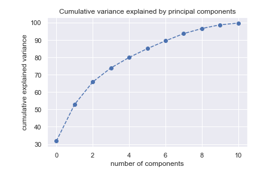
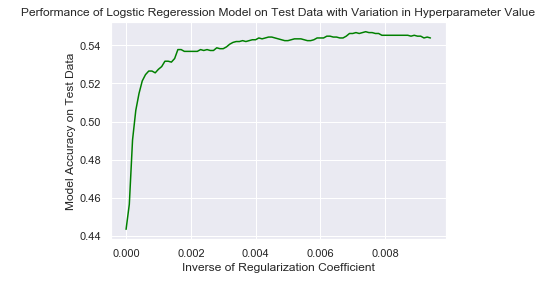

## Introduction
This study aims to compare the performance of different supervised learning algorithms to predict wine quality based on a wine’s physicochemical test results. Wine quality assessment is crucial in the wine industry and is assessed based on physicochemical tests at laboratories and on sensory tests that rely on human experts opinion on wine preferences [1].

## Background and Motivation - Renee
In 2018, over 966 million gallons of wine was consumed in the United States [2]. The lack of understanding of physicochemical properties’ effect on the taste of wine and the behavior of human taste makes wine quality categorization non-trivial [3,4].The complexity in the accuracy of prediction and the importance of wine quality assessment in the wine industry motivate the research presented here.  In this presentation, we will apply and compare the performance of supervised learning algorithms to predict wine quality.

The supervised learning models studied were regression, decision tree,  and support vector machine (SVM). The ratio of test data to training data was kept constant at 2 to 1 for each model.

Today, we will:

1. Describe the data used

2. Describe the data manipulation techniques used

3. Results:

   - Regression

   - Decision Tree

   - SVM

4. Comparison of different methods' results

5. Conclusions

## Data Description and Initial Data Exploration
This section presents insights on the wine quality dataset which will be used to model quality predictions. 

### Data Distribution in Dataset by Quality Lables and Wine Type
The dataset consists of **6,463** samples. Each sample had **13** features.

The features considered were: type (red or white), fixed acidity, volatile acidity, citric acid, residual sugar, chlorides, free sulfur dioxide, total sulfur dioxide, density, pH, sulphates, alcohol, and _quality_.

*NOTE*: 

The value 1 corresponds to white wine

The value 2 correponds to red wine
 

From here

### Feature Pairplot

Key insight on correlation betwen features - Renee

## Initial Data Exploration 
### Principal Componenet Analysis - Abhilasha
A dataset with 12 feature pushes us to conduct a Principal Componenet Analysis on the data to consider possibility of dimenstion reduction. Principal componenet analysis result for complete dataset reveals that 0.99 of total variance in dataset is explained by first 11 eigen values. PCA result indicated not much of dimension reduction can be achieved by using 2 or 3 principal componenets. Thus, there are not easily identifiable directions in which signiifcant variance of the data points can be captured. 

[0.3176715, 0.21069888, 0.12999856, 0.08094213, 0.06034393, 0.0510322, 0.04471237, 0.04190673, 0.02934314, 0.02139346, 0.00994418]

Using principal component analysis, the spread of data is visualized in 2D and 3D space below.

<iframe width="700" height="700" frameborder="0" scrolling="no" src="//plot.ly/~abhilashasaroj/108.embed"></iframe>

## Supervised Learning Models for Wine Quality Prediction
This section presents performance of several supervised learning models developed using given dataset to predict wine quality data. Traning to test data split ratio of 66% - 33% is used for validation. K-fold cross validation is used determine mean accuracy score. And confusion matrix is used to visualize the classification y the developed classifiers. 

### Quality Prediction Using Linear Regression and Polynomical Regression
First, let's look at the correlation among features and label('quality'):

From the correlation map, we can see that the most correlated feature with 'quality' is 'alchol'.
Then we want to plot the relation between each feature and label:

We can see that the linear relation bewteen each features and label is not very good prediction, so we want to do a linear combination of all features of dataset to do the prediction. 
#### (1) Linear Regression
We first split our training and test data into 66% and 34%, then we did the Linear Regression Model to fit our function, here's the outcome of our "true_y vs. predicted_y" :

##### the calculated MSE = 0.5409578
##### Test Score = 0.299689

#### (2) Polynomial Regression
First, Let's try fit the function when degree n = 3, the "true_y vs. predicted_y" looks like this:

##### the calculated MSE = 0.4848
##### Test Score = 0.3385
it is worthnoting that the degree of polynormial function influece the fitting of model, beacaue we don't want to overfit or underfit the model. so we plot the 'MSE vs. polynormial degree n' to see which degree has the lowest MSE value:

##### Discussion 
By comparing the MSE between linear regression model and polynormial model, we can conclude that for our dataset, polynormial model (when n = 2) is a little bit better than linear regression model and n = other values.

### Quality Prediction Using Ridge Regression and Lasso Regression
#### (3) Ridge Regression
For Ridge Regression, we add a regulation in the function to reduce the magnitude of the coefficients. Our goal is to find the 
 that can optimize the parameters.  If we look at the cofficients for different features in RR here:

As we increase , we will see that the magnitude of coefficeints decrease.This is because higher the   is, bigger is the penalty and therefore, the magnitude of coefficients are reduced.

if we look at the "MSE vs. " :

 we can see that MSE will decrease first as  increases and then it ramp to really high value,the lowest MSE was reached when is 100, we also plotted the "score vs. ":

we see for this case, score is presentinf an opposite trend as MSE, but it also shows a highest score at  = 100.

##### at a = 100, the MSE = 0.3799 and the Test score = 0.34

#### (4) Lasso Regression

For Lasso Regerssion, , the regulation method is different with Ridge Regression. in RR, the regulation is related to squared coefficience, however, in LR, the regulation is only related to absolute value of coefficience. Therefore, we are expecting that when we increase the value of , coefficients are approaching towards 0!!!! therefore, Lasso selects some features while reduce the coefficients of others to zero. if we look at the the cofficients for different features in LR here:

if we look at the "MSE vs. " :

 we can see that MSE keeps increase as we increase , and then it reach a platue states. we also plotted the "score vs. ":

we can see the Lasso regression can get a higher score when  is really small. at  = 0.0001, the MSE = 0.42578, and Test score = 0.39

##### Discussion 

|Model         | Linear        | Ridge,    = 100| Lasso, = 0.0001 | polynomial, n = 2 |
| ------------- | -------------| -------------------- |----------------------- |-------------------|
| MSE          | 0.5409        |0.3799.               | 0.4257                 | 0.4848            |
| TEST Score   | 0.299         |0.34                  | 0.39                   | 0.299             |

### Quality Prediction Using Logistic Regression
Logistic regression is applied on the training datatset (66%) of complete dataset. The mean accuracy from 3-fold cross validation of this model is 0.55. Classification performance of logstic classifier is shown in the confusion matrix. True positives for labels 5 and 6 are highest. Labels 3,4, 8, and 9 are not getting predicted or classified correctly. 

#### Discussion 

### Quality Prediction Using Decision Tree and Random Ensemble Classifier - Abhilasha
#### Decision Tree Classifier

Accuracy = 

##### Pruned Decision Tree Classifier
Depth=5

Accuracy =

Depth =3

Accuracy =

##### Discussion 

#### Ensemble Random Forest Classifier

Result for Random Forest Classifier with following attributes

1. n_estimators = 100
2. Depth_limit = None
3. Bootstrap = True, Model uses bootstrapped dataset to create trees instead of while dataset.

*Accuracy score = 0.62*

### Quality Prediction Using Support Vector Machine - Ogulcan

Support vector machine (SVM) was implemented for multi-class classification using "one against one" approach. Different kernel functions were applied such as RBF, polynomial and linear on both mixed (red and white wine data together) and separated datasets (separated as red and white wine). Datasets were splitted as 1/3 for test and 2/3 for training where standardization was applied only on training set.

While modelling the mixed dataset, red and white wine being a feature of dataset as the wine type, should be converted from string to an integer. This phenomenon has been investigated with RBF kernel. First, white wine was converted to 1 whereas red wine was 2. Also, using gridsearch with 3-fold cross validation, RBF kernel parameters of C and gamma were found. Confusion matrix for this case is shown below: 

               

Then, same numbers were assigned vice versa (white wine = 2, red wine = 1) to observe any difference. Resulted confusion matrix is given below:

Much difference could not be observed. However, accuracy scores for both classifications were found as 0.64. Confusion matrices for white and red wine datasets on which 'RBF' kernel was implemented is shown below (Left-white wine, Right-red wine):

      

Accuracy scores for white and red wine datasets were found as 0.63 and 0.60, respectively. Considering 0.64 accuracy score for mixed dataset, a decreasing trend was observed for separated datasets. The reason may be relatively smaller training sets with separated datasets where the features are not varying much by the wine type.

After RBF, other kernel functions were also investigated. Below figure shows that RBF kernel outperforms among others in terms of accuracy score, and is followed by polynomial and linear kernels, respectively.

 

In conclusion, maximum accuracy was obtained with RBF kernel on mixed dataset as 64 %.  

## Comparison of Prediction Models

| Learning Classifier | Accuracy |
| ------------- | ------------- |
| Linear Regression  | xx  |
| Polynomial Regression  | xx  |
| Ridge Regression  | xx  |
| Lasso Regression  |xx  |
| Logistic Regression | xx |
| Decision Tree  |xx |
| Random Forest  | xx |
| Support Vector Machine  | xx |

## Conclusion

## References
[1] P. Cortez, A. Cerdeira, F. Almeida, T. Matos, J. Reis, “Modeling wine preferences by data mining from physicochemical properties,” Decision Support Systems,” Vol. 47(4), 2009, p. 547-553.
[2] https://www.wineinstitute.org/resources/statistics/article86
[3] A. Legin, A. Rudnitskaya, L. Luvova, Y. Vlasov, C. Natale, and A. D’Amico. Evaluation of Italian wine by the electronic tongue: recognition, quantitative analysis and correlation with human sensory perception. Analytica Chimica Acta, pages 33–34, 2003.
[4] D. Smith and R. Margolskee. Making sense of taste. Scientific American, 284:26– 33, 2001.

Thank you

